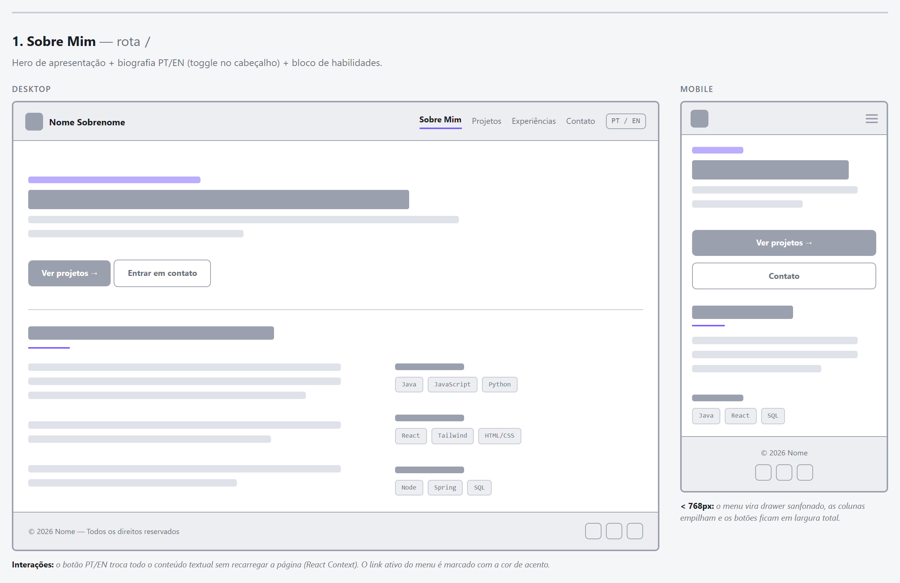
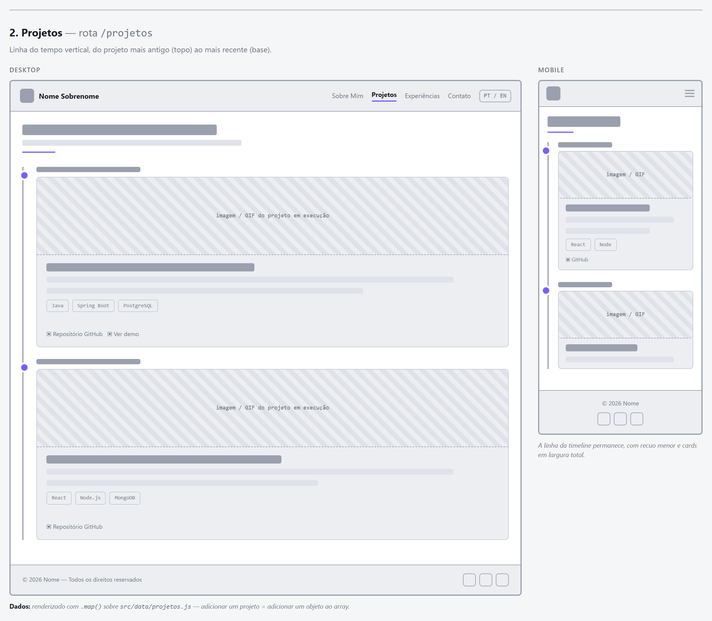
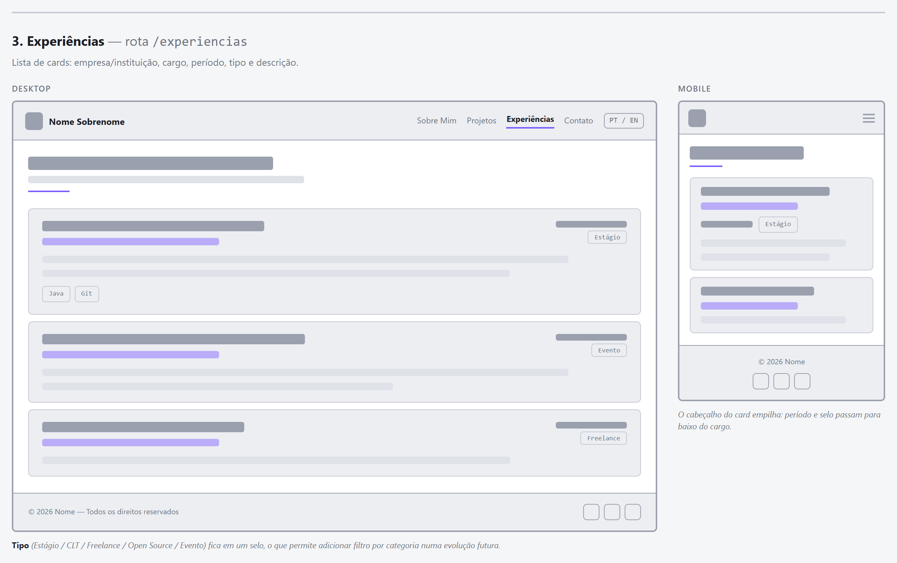
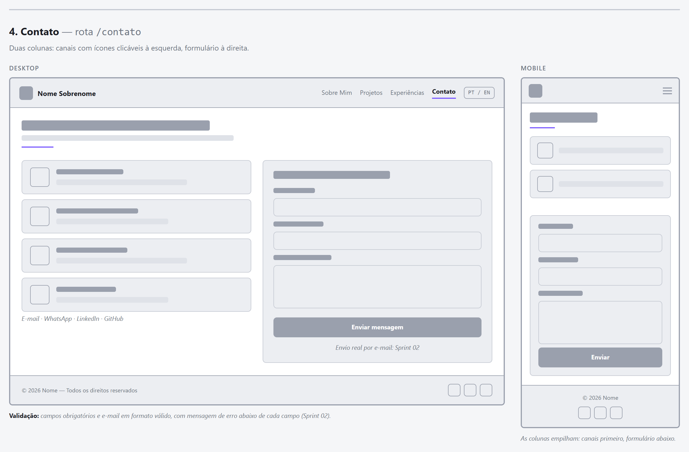
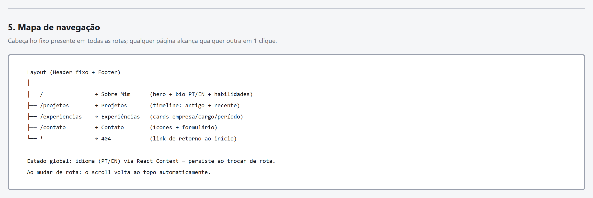

# Portfólio Profissional

Website de portfólio profissional desenvolvido para a disciplina **Laboratório de Desenvolvimento de Software** — PUC Minas, Engenharia de Software, 2º semestre de 2026.

> **Status:** Sprint 02 (Lab01S02) — timeline dinâmica, filtros, formulário validado e responsividade.

---

## Sumário

- [Sobre o projeto](#sobre-o-projeto)
- [Protótipos e wireframes](#protótipos-e-wireframes)
- [Tecnologias previstas](#tecnologias-previstas)
- [Dependências](#dependências)
- [Estrutura de diretórios](#estrutura-de-diretórios)
- [Instalação e execução local](#instalação-e-execução-local)
- [Formulário de contato](#formulário-de-contato)
- [Documentação de requisitos](#documentação-de-requisitos)
- [Identidade visual](#identidade-visual)
- [Roteiro das sprints](#roteiro-das-sprints)

---

## Sobre o projeto

Aplicação web de página única (SPA) que apresenta trajetória acadêmica e profissional, projetos desenvolvidos, experiências e canais de contato. O site é dividido em quatro seções acessadas por um menu de navegação:

| Rota | Seção | Conteúdo |
| --- | --- | --- |
| `/` | **Sobre Mim** | Apresentação em português e inglês, formação, área de atuação, interesses, objetivos e habilidades técnicas |
| `/projetos` | **Projetos** | Linha do tempo do projeto mais antigo ao mais recente, com nome, descrição, tecnologias e link do repositório |
| `/experiencias` | **Experiências** | Experiências profissionais, estágios, freelas, projetos open source e eventos técnicos, com empresa, cargo, período e descrição |
| `/contato` | **Contato** | Ícones clicáveis (e-mail, WhatsApp, LinkedIn, GitHub) e formulário de mensagem |

Todo o conteúdo textual alterna entre **português e inglês** por meio de um botão no cabeçalho, sem recarregar a página.

---

## Protótipos e wireframes

Os wireframes de média fidelidade cobrem as quatro páginas em versão **desktop (1440px)** e **mobile (375px)**, incluindo o mapa de navegação.

📄 Arquivo navegável: [`docs/wireframes/wireframes.html`](docs/wireframes/wireframes.html) — abra no navegador.

| Sobre Mim | Projetos |
| --- | --- |
|  |  |

| Experiências | Contato |
| --- | --- |
|  |  |

**Mapa de navegação**



A seção 6 do arquivo de wireframes traz ainda a **tela de seleção de perfil**, especificada em [Documentação de requisitos](#documentação-de-requisitos).


---

## Tecnologias previstas

| Camada | Tecnologia | Justificativa |
| --- | --- | --- |
| Biblioteca de UI | **React 18** | Componentização e reaproveitamento de layout entre as páginas |
| Build / dev server | **Vite 5** | Inicialização rápida, HMR e build otimizado para deploy estático |
| Estilização | **Tailwind CSS 3** | Utilitários com design responsivo e identidade visual própria, sem depender de tema de terceiros |
| Roteamento | **React Router 6** | Páginas separadas por rota, com layout compartilhado |
| Ícones | **lucide-react** | Conjunto de ícones SVG leve e consistente |
| Internacionalização | **React Context** | Alternância PT/EN sem biblioteca externa |
| Hospedagem (Sprint 03) | **Vercel** | Deploy gratuito e integrado ao GitHub |

---

## Dependências

**Produção**

| Pacote | Versão |
| --- | --- |
| `react` | ^18.3.1 |
| `react-dom` | ^18.3.1 |
| `react-router-dom` | ^6.28.0 |
| `lucide-react` | ^0.454.0 |

**Desenvolvimento**

| Pacote | Versão |
| --- | --- |
| `vite` | ^5.4.11 |
| `@vitejs/plugin-react` | ^4.3.4 |
| `tailwindcss` | ^3.4.17 |
| `postcss` | ^8.4.49 |
| `autoprefixer` | ^10.4.20 |

---

## Estrutura de diretórios

```
portfolio/
├── docs/
│   └── wireframes/
│       └── wireframes.html      # Wireframes de média fidelidade (desktop + mobile)
├── public/
│   └── favicon.svg              # Ícone da aba
├── src/
│   ├── components/
│   │   ├── Filtros.jsx          # Barra de chips de filtro (Projetos e Experiências)
│   │   ├── Footer.jsx           # Rodapé com links sociais
│   │   ├── Header.jsx           # Cabeçalho fixo, menu responsivo e toggle PT/EN
│   │   ├── Layout.jsx           # Estrutura base: header + área de conteúdo + footer
│   │   └── SectionHeader.jsx    # Título padrão das seções
│   ├── context/
│   │   └── LanguageContext.jsx  # Estado global do idioma (PT/EN)
│   ├── data/
│   │   ├── contatos.js          # Canais de contato
│   │   ├── experiencias.js      # Experiências profissionais
│   │   ├── perfil.js            # Dados pessoais, bio e habilidades
│   │   ├── projetos.js          # Projetos da timeline
│   │   └── textos.js            # Labels da interface em PT e EN
│   ├── servicos/
│   │   ├── envio.js             # Ponto único de envio da mensagem de contato
│   │   └── validacao.js         # Regras de validação do formulário
│   ├── utils/
│   │   └── datas.js             # Formatação e ordenação dos períodos
│   ├── pages/
│   │   ├── Contato.jsx
│   │   ├── Experiencias.jsx
│   │   ├── NaoEncontrada.jsx    # Página 404
│   │   ├── Projetos.jsx
│   │   └── Sobre.jsx
│   ├── App.jsx                  # Definição das rotas
│   ├── index.css                # Base do Tailwind e classes de componente
│   └── main.jsx                 # Ponto de entrada da aplicação
├── index.html
├── package.json
├── postcss.config.js
├── tailwind.config.js
└── vite.config.js
```

O conteúdo fica **separado da apresentação**: os arquivos em `src/data/` concentram todos os dados pessoais, de modo que adicionar um projeto ou uma experiência não exige alterar componentes.

---

## Instalação e execução local

**Pré-requisitos:** Node.js 18+ e npm.

```bash
# 1. Clonar o repositório
git clone https://github.com/viniciusoramos/Portifolio_Pessoal.git
cd Portifolio_Pessoal

# 2. Instalar as dependências
npm install

# 3. Iniciar o servidor de desenvolvimento
npm run dev
```

A aplicação ficará disponível em `http://localhost:5173`.

**Outros comandos**

| Comando | Descrição |
| --- | --- |
| `npm run dev` | Servidor de desenvolvimento com hot reload |
| `npm run build` | Gera a versão de produção em `dist/` |
| `npm run preview` | Serve localmente o conteúdo de `dist/` |

---

## Formulário de contato

**Validação.** Feita no cliente, sem biblioteca externa, com as regras isoladas em `src/servicos/validacao.js` para poderem ser testadas fora do componente:

| Campo | Regra |
| --- | --- |
| Nome | Obrigatório, mínimo 2 e máximo 80 caracteres |
| E-mail | Obrigatório, formato válido, máximo 120 caracteres |
| Mensagem | Obrigatória, mínimo 10 e máximo 1000 caracteres, com contador de restantes |

O campo só passa a acusar erro depois do primeiro `blur`, para não reclamar já na primeira letra digitada. No envio, todos são revalidados, o foco vai para o primeiro campo inválido e cada erro é anunciado por leitor de tela (`aria-invalid`, `aria-describedby` e `role="alert"`).

**Envio.** `src/servicos/envio.js` é o único ponto que conhece o transporte. Hoje monta um link `mailto:` e abre o aplicativo de e-mail do visitante com assunto e corpo preenchidos — funciona em hospedagem estática, sem back-end nem chave de API. Para trocar por envio automático (Web3Forms, EmailJS ou uma função serverless na Vercel), basta reescrever o corpo de `enviarMensagem` mantendo a assinatura e o retorno `{ ok }`; nenhuma página muda.

---

## Documentação de requisitos

**[Perfis de Acesso — Levantamento de Requisitos e Casos de Uso](docs/perfis-de-acesso.md)**

Documento de análise da funcionalidade de perfis de acesso: ao entrar no site, o visitante informa se é recrutador, professor, desenvolvedor ou visitante geral, e o portfólio passa a destacar o que interessa a cada um — sem esconder nada e sem login.

Cobre visão geral e escopo, os 4 perfis e a matriz de destaques por seção, 14 requisitos funcionais e 8 não funcionais, 5 regras de negócio, 6 casos de uso com fluxos alternativos e exceções, matriz de rastreabilidade, critérios de aceite, modelo de dados proposto e o wireframe da tela de seleção.

Implementação prevista para o Lab01S03.

---

## Identidade visual

Tema escuro minimalista, com foco em legibilidade e destaque para o conteúdo.

| Token | Cor | Uso |
| --- | --- | --- |
| `bg` | `#0B0D12` | Fundo da página |
| `surface` | `#12151D` | Fundo dos cards |
| `elevated` | `#171B25` | Elementos sobrepostos e selos |
| `line` | `#232838` | Bordas e divisórias |
| `fg` | `#E6E8EE` | Texto principal |
| `muted` | `#8B93A7` | Texto secundário |
| `accent` | `#7C5CFF` | Ações, links ativos e marcadores |
| `accent2` | `#22D3EE` | Destaques de apoio |

**Tipografia:** Inter (texto) e JetBrains Mono (dados técnicos, períodos e tags).

**Responsividade:** breakpoints em 640px, 768px e 1024px; menu vira drawer abaixo de 768px e as grades de duas colunas empilham.

---

## Roteiro das sprints

- [x] **Lab01S01** — Repositório, wireframes, protótipo do front-end, navegação e layout principal
- [ ] **Lab01S02** — Timeline com ordenação automática e filtro por tecnologia, experiências filtráveis por tipo, períodos formatados por idioma, formulário com validação completa e responsividade revisada.
  Pendente: preencher os arquivos de `src/data/` com o conteúdo real e substituir o `mailto:` por envio automático de e-mail.
- [ ] **Lab01S03** — Deploy em nuvem, ajustes visuais e README final

---

## Autor

**Vinícius Oliveira Ramos** — Engenharia de Software, 6º período, PUC Minas — Belo Horizonte, MG

- Repositório: [github.com/viniciusoramos/Portifolio_Pessoal](https://github.com/viniciusoramos/Portifolio_Pessoal)
- E-mail: [vinicius.ramos@pucminas.edu.br](mailto:vinicius.ramos@pucminas.edu.br)
