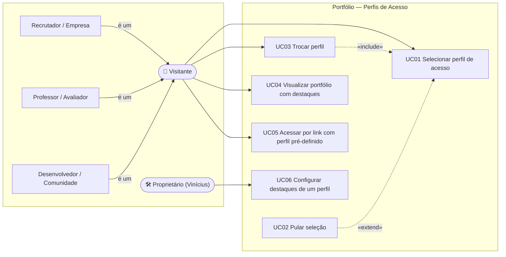
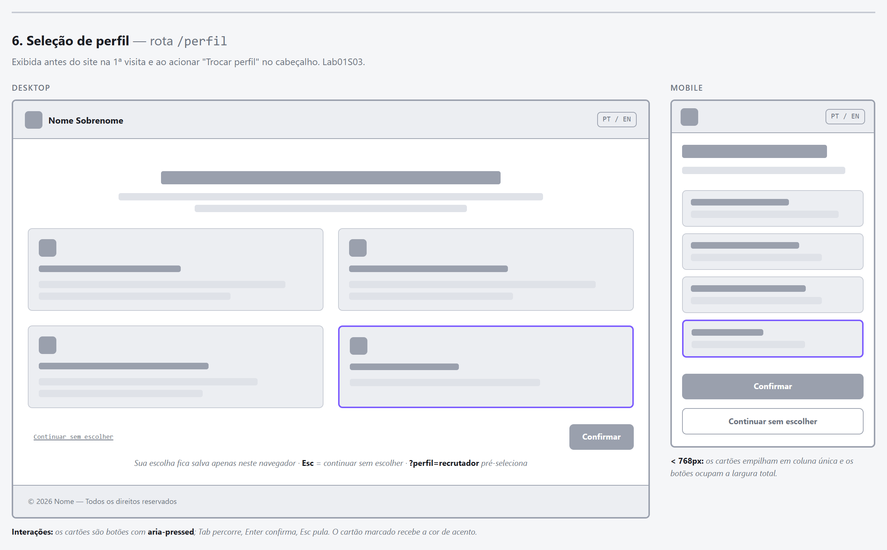

# Perfis de Acesso — Levantamento de Requisitos e Casos de Uso

> **Lab01 · Sprint 02 · Portfólio Profissional — Vinícius Oliveira Ramos**
> Versão 1.1 · 02/09/2026 · Status: validado com o PO (decisões na seção 11) · Implementação: pendente, prevista para o Lab01S03

---

## Sumário

- [1. Visão geral](#1-visão-geral)
- [2. Perfis de acesso](#2-perfis-de-acesso)
- [3. Requisitos funcionais](#3-requisitos-funcionais)
- [4. Requisitos não funcionais](#4-requisitos-não-funcionais)
- [5. Regras de negócio](#5-regras-de-negócio)
- [6. Casos de uso](#6-casos-de-uso)
- [7. Matriz de rastreabilidade](#7-matriz-de-rastreabilidade)
- [8. Critérios de aceite](#8-critérios-de-aceite)
- [9. Modelo de dados proposto](#9-modelo-de-dados-proposto)
- [10. Wireframe da tela de seleção](#10-wireframe-da-tela-de-seleção)
- [11. Decisões de validação com o PO](#11-decisões-de-validação-com-o-po)

---

## 1. Visão geral

### 1.1 Problema

O portfólio é visitado por públicos com interesses diferentes. Um **recrutador** quer saber rapidamente o que sei fazer e como me contatar; um **professor** quer ver formação, projetos acadêmicos e o código; um **desenvolvedor** quer stack, repositórios e contribuições. Hoje todos veem exatamente a mesma página, com o mesmo destaque para tudo.

### 1.2 Solução proposta

Ao entrar no site, o visitante escolhe **quem ele é** em uma tela simples de seleção (sem login, sem senha, sem cadastro). A partir daí o portfólio **adapta o destaque** das informações — ordem, ênfase visual, chamadas para ação e canais de contato sugeridos — de acordo com o perfil escolhido.

**Princípio central:** o *conteúdo* é sempre o mesmo. Nenhuma informação é escondida ou alterada; muda apenas **o que aparece em evidência**.

### 1.3 Escopo

| Dentro do escopo | Fora do escopo |
| --- | --- |
| Tela de seleção de perfil na primeira visita | Autenticação, login, senha, cadastro |
| Troca de perfil a qualquer momento | Conteúdo exclusivo/oculto por perfil |
| Persistência da escolha no navegador | Armazenamento de dados do visitante em servidor |
| Link compartilhável com perfil pré-definido | Painel administrativo para editar destaques |
| Destaques por perfil nas 4 seções | Analytics / rastreamento de quem acessou |

### 1.4 Stakeholders e atores

| Ator | Descrição | Interesse principal |
| --- | --- | --- |
| **Visitante** (ator primário) | Qualquer pessoa que acessa o site | Encontrar rapidamente o que lhe interessa |
| ↳ Recrutador / Empresa | Profissional de RH, tech lead, empresa avaliando contratação | Experiência, habilidades, contato rápido |
| ↳ Professor / Avaliador | Docente ou banca avaliando o trabalho acadêmico | Formação, projetos acadêmicos, código-fonte, evolução |
| ↳ Desenvolvedor / Comunidade | Colegas, comunidade open source | Stack, repositórios, código |
| Visitante geral | O próprio ator Visitante, sem especialização — quem não se identifica ou pula a seleção | Visão equilibrada |
| **Proprietário** (Vinícius) | Dono do portfólio | Definir o que cada perfil vê em destaque (via código/dados) |

---

## 2. Perfis de acesso

| ID | Perfil | Quem é | O que ganha destaque |
| --- | --- | --- | --- |
| `geral` | Visitante geral *(padrão)* | Não se identificou ou pulou | Layout equilibrado atual |
| `recrutador` | Recrutador / Empresa | RH, tech lead, empresa | Experiência na CPMH, habilidades de planejamento cirúrgico virtual, projetos com uso real, contato por LinkedIn/e-mail |
| `professor` | Professor / Avaliador | Docente, banca | Formação, projetos acadêmicos, tecnologias aprendidas, repositórios e README, este próprio portfólio |
| `dev` | Desenvolvedor / Comunidade | Colegas, open source | Stack técnica, GitHub, projetos com código aberto, tecnologias por projeto |

### 2.1 Matriz de destaques por perfil

O que muda em cada seção, por perfil. **Tudo continua visível em todos os perfis.**

| Seção | Geral | Recrutador | Professor | Desenvolvedor |
| --- | --- | --- | --- | --- |
| **Sobre Mim** — frase de destaque (hero) | Apresentação padrão | Objetivo profissional e disponibilidade | Formação e contexto acadêmico | Stack e o que gosto de construir |
| **Sobre Mim** — CTA primário | Ver projetos | Entrar em contato (LinkedIn) | Ver projetos acadêmicos | Ver GitHub |
| **Sobre Mim** — ordem dos blocos | Formação, Atuação, Objetivos | Atuação, Objetivos, Formação | Formação, Atuação, Objetivos | Atuação, Objetivos, Formação |
| **Sobre Mim** — grupos de habilidade | Ordem padrão | Planejamento cirúrgico virtual, Desenvolvimento web, Linguagens, Ferramentas | Linguagens, Ferramentas, Planejamento cirúrgico virtual, Desenvolvimento web | Desenvolvimento web, Linguagens, Ferramentas, Planejamento cirúrgico virtual |
| **Projetos** — timeline | Cronológica | Cronológica | Cronológica | Cronológica |
| **Projetos** — marcação "Destaque" | Nenhuma | Projetos com uso real (`profissional`) | Projetos de disciplina (`academico`) | Projetos com código aberto (`open-source`) |
| **Projetos** — faixa "Destaques para você" | Não exibe | Atalhos para os destacados | Atalhos para os destacados | Atalhos para os destacados |
| **Experiências** — marcação | Nenhuma | `profissional`, `freelance` | `academico`, `evento` | `freelance`, `open-source` |
| **Contato** — ordem dos canais | E-mail, WhatsApp, LinkedIn, GitHub | LinkedIn, E-mail, WhatsApp, GitHub | E-mail, GitHub, LinkedIn, WhatsApp | GitHub, E-mail, LinkedIn, WhatsApp |
| **Contato** — assunto sugerido | (vazio) | "Oportunidade de vaga" | "Avaliação do portfólio" | "Colaboração em projeto" |

> **Nota de conteúdo.** Hoje o portfólio não possui itens com as tags `freelance` nem `evento`. Enquanto for assim, as marcações correspondentes simplesmente não aparecem — comportamento previsto no fluxo alternativo A2 do UC04.

---

## 3. Requisitos funcionais

| ID | Requisito | Prioridade |
| --- | --- | --- |
| **RF01** | O sistema deve exibir, na primeira visita, uma **página de seleção de perfil** (rota `/perfil`, antes do site) com as opções *Recrutador/Empresa*, *Professor/Avaliador*, *Desenvolvedor/Comunidade* e *Visitante geral*, cada uma com título, ícone e descrição curta. | Alta |
| **RF02** | O visitante deve poder **pular** a seleção; nesse caso o perfil `geral` é aplicado. | Alta |
| **RF03** | O perfil escolhido deve ser **persistido no navegador** (`localStorage`) e a tela de seleção não deve ser exibida novamente enquanto houver perfil salvo. | Alta |
| **RF04** | O cabeçalho deve exibir o perfil ativo em texto ("Vendo como: Recrutador") e permitir **trocar de perfil** a qualquer momento, levando à página de seleção. | Alta |
| **RF05** | A página *Sobre Mim* deve adaptar, conforme o perfil: frase de destaque do hero, CTA primário, ordem dos blocos de informação e ordem dos grupos de habilidade. | Alta |
| **RF06** | A página *Projetos* deve manter a **ordem cronológica** da timeline e marcar visualmente como "Destaque" os projetos relevantes ao perfil. | Alta |
| **RF07** | A página *Projetos* deve exibir, para perfis diferentes de `geral`, uma faixa "Destaques para você" com atalhos (âncoras) para os projetos destacados. | Média |
| **RF08** | A página *Experiências* deve marcar visualmente as experiências relevantes ao perfil, mantendo a ordem. | Alta |
| **RF09** | A página *Contato* deve reordenar os canais conforme o perfil e pré-preencher o campo **Assunto** do formulário com um assunto sugerido (editável). | Média |
| **RF10** | **Todo o conteúdo deve permanecer visível e acessível em qualquer perfil**; perfis nunca ocultam informação. | Alta |
| **RF11** | Os textos da tela de seleção e dos destaques devem respeitar o idioma ativo (PT/EN). | Alta |
| **RF12** | O sistema deve aceitar o parâmetro de URL `?perfil=<id>` para pré-selecionar um perfil (ex.: link enviado a um recrutador), com precedência sobre o perfil salvo. | Média |
| **RF13** | A tela de seleção deve ser operável por teclado (Tab/Enter/Esc) e anunciada corretamente por leitores de tela (foco, `aria-label`, `role="dialog"`). | Média |
| **RF14** | O proprietário deve conseguir configurar os destaques de cada perfil editando **apenas dados** (`src/data/perfis.js`), sem alterar componentes. | Média |

---

## 4. Requisitos não funcionais

| ID | Requisito | Categoria |
| --- | --- | --- |
| **RNF01** | A funcionalidade deve ser 100% client-side, sem back-end e sem autenticação, mantendo a hospedagem estática gratuita. | Arquitetura |
| **RNF02** | A troca de perfil deve refletir na interface imediatamente (< 100 ms), sem recarregar a página. | Desempenho |
| **RNF03** | Nenhum dado do visitante (perfil escolhido, nome, e-mail) deve ser enviado a servidores; a escolha fica apenas no navegador dele. | Privacidade |
| **RNF04** | A tela de seleção e os destaques devem ser responsivos (mobile ≥ 360 px, tablet, desktop). | Usabilidade |
| **RNF05** | Os destaques devem ser descritos de forma **declarativa** (dados), evitando duplicação de conteúdo entre perfis. | Manutenibilidade |
| **RNF06** | Adicionar um novo perfil deve exigir apenas a inclusão de um objeto no arquivo de perfis e suas traduções. | Extensibilidade |
| **RNF07** | Contraste mínimo 4.5:1 nos elementos de destaque e foco visível nos controles (WCAG 2.1 AA). | Acessibilidade |
| **RNF08** | Se o `localStorage` estiver indisponível (modo privado/bloqueado), o site deve funcionar normalmente com o perfil `geral`. | Robustez |

---

## 5. Regras de negócio

| ID | Regra |
| --- | --- |
| **RN01** | O conteúdo do portfólio é único. Perfis alteram somente ênfase visual, ordem, chamadas para ação e sugestões — nunca o conteúdo em si. |
| **RN02** | A timeline de projetos é sempre cronológica (do mais antigo ao mais recente), em qualquer perfil — requisito original do enunciado. |
| **RN03** | Na ausência de escolha (primeira visita pulada ou storage indisponível), vale o perfil `geral`. |
| **RN04** | O parâmetro de URL `?perfil=` tem precedência sobre o perfil salvo e, se válido, substitui o salvo. Valores inválidos são ignorados. |
| **RN05** | A relevância de um projeto/experiência para um perfil é definida por **tags** no conteúdo (`academico`, `profissional`, `freelance`, `open-source`, `evento`) cruzadas com as tags que cada perfil destaca. |

---

## 6. Casos de uso

### 6.1 Diagrama



- **Generalização** ("é um"): Recrutador, Professor e Desenvolvedor são especializações do ator **Visitante** e herdam todas as suas associações. O *Visitante geral* é o próprio ator base, sem especialização.
- **Associações**: o Visitante é ator dos quatro casos de uso que representam metas suas — UC01, UC03, UC04 e UC05. O **Proprietário** é ator secundário, associado apenas ao UC06.
- **`«include»`** (UC03 → UC01): trocar de perfil **sempre** passa pela seleção, então UC03 inclui UC01 obrigatoriamente.
- **`«extend»`** (UC02 → UC01): pular a seleção é comportamento **opcional e condicional**, inserido no ponto de extensão *"escolha do perfil"* de UC01. A seta aponta do caso que estende para o caso base.

**Por que UC04 não tem `«include»`.** Selecionar um perfil não *inclui* visualizar o portfólio: são duas metas distintas do visitante, uma acontecendo depois da outra. Sequência temporal não é relacionamento de caso de uso em UML — expressa-se por pré-condição, e é assim que o UC04 a registra. `«include»` fica reservado a comportamento compartilhado invocado de dentro de outro caso de uso.

### 6.2 UC01 — Selecionar perfil de acesso

| Campo | Descrição |
| --- | --- |
| **Ator** | Visitante |
| **Objetivo** | Informar quem é para receber o portfólio com os destaques adequados |
| **Pré-condições** | Não há perfil salvo no navegador **ou** o visitante acionou "Trocar perfil" (UC03) |
| **Pós-condições** | Perfil salvo no navegador; portfólio exibido com os destaques do perfil (UC04) |
| **Requisitos** | RF01, RF03, RF11, RF13 |

**Fluxo principal**

1. O visitante acessa qualquer página do site.
2. O sistema detecta que não há perfil salvo e redireciona para a página de seleção (`/perfil`), com as 4 opções (título, ícone, descrição) no idioma ativo.
3. O visitante escolhe uma opção.
4. O sistema salva o perfil e redireciona para a página que o visitante tentou abrir (ou a home), já com os destaques aplicados (UC04).
5. O cabeçalho passa a exibir o perfil ativo.

**Fluxos alternativos**

- **A1 — Pular** (passo 3): o visitante clica em "Continuar sem escolher" → segue UC02.
- **A2 — Troca de idioma** (passo 3): o visitante alterna PT/EN na própria tela; as opções são retraduzidas sem perder o estado.
- **A3 — Teclado** (passo 3): o visitante navega com Tab e confirma com Enter; Esc equivale a pular.

**Exceções**

- **E1 — `localStorage` indisponível** (passo 4): o sistema aplica o perfil apenas em memória para a sessão atual e não exibe erro; na próxima visita a tela aparece de novo (RNF08).

### 6.3 UC02 — Pular seleção

| Campo | Descrição |
| --- | --- |
| **Ator** | Visitante |
| **Objetivo** | Ver o portfólio sem se identificar |
| **Pré-condições** | Tela de seleção exibida (UC01) |
| **Pós-condições** | Perfil `geral` salvo; tela não reaparece nas próximas visitas |
| **Relacionamento** | `«extend»` de UC01, no ponto de extensão *"escolha do perfil"* |
| **Requisitos** | RF02, RF03 |

**Fluxo principal**

1. Na tela de seleção, o visitante clica em "Continuar sem escolher" (ou pressiona Esc).
2. O sistema salva o perfil `geral` e fecha a tela.
3. O portfólio é exibido no layout padrão (UC04).

**Fluxo alternativo**

- **A1:** o visitante pode, depois, escolher um perfil pelo cabeçalho (UC03).

### 6.4 UC03 — Trocar perfil

| Campo | Descrição |
| --- | --- |
| **Ator** | Visitante |
| **Objetivo** | Mudar o perfil ativo a qualquer momento |
| **Pré-condições** | Existe um perfil ativo (inclusive `geral`) |
| **Pós-condições** | Novo perfil salvo e destaques atualizados sem recarregar a página |
| **Relacionamento** | `«include»` UC01 — a troca sempre passa pela tela de seleção |
| **Requisitos** | RF04, RNF02 |

**Fluxo principal**

1. O visitante clica no indicador de perfil no cabeçalho (ex.: "Vendo como: Recrutador").
2. O sistema abre a página de seleção com o perfil atual marcado.
3. O visitante escolhe outro perfil (UC01, passo 3) ou volta mantendo o atual.
4. O sistema atualiza os destaques da página imediatamente.

**Fluxo alternativo**

- **A1 — Menu mobile:** o indicador fica dentro do menu hambúrguer; o restante é idêntico.

### 6.5 UC04 — Visualizar portfólio com destaques

| Campo | Descrição |
| --- | --- |
| **Ator** | Visitante |
| **Objetivo** | Navegar pelas seções vendo em evidência o que é relevante para seu perfil |
| **Pré-condições** | Perfil ativo definido (por UC01, UC02 ou UC05) |
| **Pós-condições** | — |
| **Relacionamento** | Nenhum. É meta própria do Visitante; a definição do perfil é pré-condição, não inclusão |
| **Requisitos** | RF05–RF11, RN01, RN02, RN05 |

**Fluxo principal**

1. O visitante navega para uma seção.
2. O sistema consulta a configuração do perfil ativo e aplica os destaques da seção conforme a matriz da seção 2.1:
   - *Sobre Mim*: frase do hero, CTA primário, ordem dos blocos e dos grupos de habilidade;
   - *Projetos*: timeline cronológica + marcação "Destaque" nos projetos cujas tags casam com o perfil + faixa "Destaques para você" (perfis ≠ `geral`);
   - *Experiências*: marcação nas experiências relevantes;
   - *Contato*: canais reordenados + assunto sugerido no formulário.
3. Todo o conteúdo restante permanece visível na mesma página.

**Fluxos alternativos**

- **A1 — Perfil `geral`:** nenhuma marcação de destaque é exibida; layout padrão.
- **A2 — Nenhum item relevante** (ex.: perfil sem projetos com a tag): a faixa "Destaques para você" não é exibida e a timeline aparece sem marcações.

### 6.6 UC05 — Acessar por link com perfil pré-definido

| Campo | Descrição |
| --- | --- |
| **Ator** | Visitante (a partir de link enviado pelo proprietário) |
| **Objetivo** | Abrir o portfólio já no perfil adequado, sem passar pela seleção |
| **Pré-condições** | URL contém `?perfil=<id>` válido |
| **Pós-condições** | Perfil da URL salvo como ativo; tela de seleção não exibida |
| **Requisitos** | RF12, RN04 |

**Fluxo principal**

1. O visitante abre `https://<site>/?perfil=recrutador`.
2. O sistema valida o id, salva-o como perfil ativo (substituindo o anterior, se houver) e remove o parâmetro da URL.
3. O portfólio é exibido com os destaques do perfil (UC04), sem a tela de seleção.

**Exceção**

- **E1 — id inválido:** o parâmetro é ignorado e o fluxo segue como acesso normal (UC01 se não houver perfil salvo).

### 6.7 UC06 — Configurar destaques de um perfil

| Campo | Descrição |
| --- | --- |
| **Ator** | Proprietário (Vinícius) |
| **Objetivo** | Definir ou ajustar o que cada perfil vê em destaque |
| **Pré-condições** | Acesso ao repositório |
| **Pós-condições** | Novo comportamento publicado após deploy |
| **Requisitos** | RF14, RNF05, RNF06 |

**Fluxo principal**

1. O proprietário edita `src/data/perfis.js` (frase do hero, CTA, ordens, tags destacadas, canais, assunto) e, se necessário, as tags em `projetos.js` / `experiencias.js` e as traduções em `textos.js`.
2. Executa `npm run build` para garantir que o projeto continua compilando.
3. Faz commit e push; o deploy contínuo publica.

**Fluxo alternativo**

- **A1 — Novo perfil:** adiciona um novo objeto ao array de perfis e suas traduções; a tela de seleção passa a listá-lo automaticamente.

> **Observação de implementação.** O projeto é JavaScript, não TypeScript — o build não valida ids nem tags. Para não depender de disciplina do editor, o `PerfilContext` deve validar o id lido do `localStorage` e da URL contra a lista de perfis conhecidos, caindo em `geral` quando não reconhecer (RN03, RN04).

---

## 7. Matriz de rastreabilidade

| Caso de uso | Requisitos atendidos |
| --- | --- |
| UC01 Selecionar perfil | RF01, RF03, RF11, RF13, RNF04, RNF07, RNF08 |
| UC02 Pular seleção | RF02, RF03, RN03 |
| UC03 Trocar perfil | RF04, RNF02 |
| UC04 Visualizar com destaques | RF05, RF06, RF07, RF08, RF09, RF10, RF11, RN01, RN02, RN05 |
| UC05 Link com perfil | RF12, RN04 |
| UC06 Configurar destaques | RF14, RNF05, RNF06 |

---

## 8. Critérios de aceite

- [ ] Ao abrir o site pela primeira vez, a tela de seleção aparece com 4 opções e a opção de pular. *(RF01, RF02)*
- [ ] Após escolher, recarregar a página **não** mostra a tela novamente. *(RF03)*
- [ ] O cabeçalho mostra o perfil ativo e permite trocá-lo; a troca atualiza a página sem reload. *(RF04, RNF02)*
- [ ] Em *Projetos*, a ordem é cronológica em todos os perfis e os projetos relevantes recebem a marcação "Destaque". *(RF06, RN02)*
- [ ] Nenhum projeto, experiência, habilidade ou canal de contato desaparece ao trocar de perfil. *(RF10, RN01)*
- [ ] `?perfil=professor` abre direto no perfil Professor. `?perfil=xyz` é ignorado. *(RF12, RN04)*
- [ ] Alternar PT/EN traduz a tela de seleção e os rótulos de destaque. *(RF11)*
- [ ] A tela de seleção funciona só com teclado e em uma tela de 360 px de largura. *(RF13, RNF04)*

---

## 9. Modelo de dados proposto

O projeto é JavaScript com nomes em português (convenção já adotada em `src/`), então o modelo abaixo segue o mesmo padrão dos arquivos existentes em `src/data/`.

```js
// src/data/perfis.js
//
// ids válidos:  'geral' | 'recrutador' | 'professor' | 'dev'
// tags válidas: 'academico' | 'profissional' | 'freelance' | 'open-source' | 'evento'
//
// Cada perfil:
//   id                       identificador do perfil
//   icone                    nome do ícone lucide-react
//   rotulo                   { pt, en } — título do cartão na tela de seleção
//   descricao                { pt, en } — linha de apoio do cartão
//   hero                     { frase: { pt, en }, ctaPrimario: 'projetos' | 'contato' | 'github' }
//   ordemBlocosSobre         ordem dos parágrafos: 'formacao' | 'atuacao' | 'objetivos'
//   ordemGruposHabilidade    ordem dos grupos de perfil.habilidades
//   tagsDestaque             projetos/experiências com estas tags recebem "Destaque"
//   ordemContato             'email' | 'whatsapp' | 'linkedin' | 'github'
//   assuntoSugerido          { pt, en } — pré-preenche o campo Assunto do formulário
export const perfis = [
  {
    id: 'recrutador',
    icone: 'Briefcase',
    rotulo: { pt: 'Recrutador / Empresa', en: 'Recruiter / Company' },
    descricao: {
      pt: 'Experiências, habilidades e contato rápido em evidência.',
      en: 'Experience, skills and quick contact up front.',
    },
    hero: {
      frase: {
        pt: 'Engenharia de software aplicada ao planejamento cirúrgico virtual.',
        en: 'Software engineering applied to virtual surgical planning.',
      },
      ctaPrimario: 'contato',
    },
    ordemBlocosSobre: ['atuacao', 'objetivos', 'formacao'],
    ordemGruposHabilidade: ['planejamento', 'web', 'linguagens', 'ferramentas'],
    tagsDestaque: ['profissional', 'freelance'],
    ordemContato: ['linkedin', 'email', 'whatsapp', 'github'],
    assuntoSugerido: { pt: 'Oportunidade de vaga', en: 'Job opportunity' },
  },
  // ...  'professor', 'dev' e 'geral'
]
```

Alterações necessárias nos arquivos existentes:

| Arquivo | Alteração |
| --- | --- |
| `src/data/projetos.js` | cada projeto ganha `tags: []` |
| `src/data/experiencias.js` | cada experiência ganha `tags: []` |
| `src/data/perfil.js` | cada grupo de `habilidades` ganha uma `chave` (`'planejamento'`, `'linguagens'`, `'web'`, `'ferramentas'`) para poder ser reordenado |
| `src/data/textos.js` | textos da tela de seleção, rótulo "Vendo como", rótulo "Destaque" e título da faixa "Destaques para você" |

Um **`PerfilContext`** (análogo ao `LanguageContext` já existente) guarda o perfil ativo, lê e grava o `localStorage` e trata o `?perfil=`. Os componentes recebem o perfil e aplicam ordem e marcação — sem `if` por perfil espalhado pelo código.

---

## 10. Wireframe da tela de seleção



Desktop e mobile, seção 6 de [`docs/wireframes/wireframes.html`](wireframes/wireframes.html).

---

## 11. Decisões de validação com o PO (26/08/2026)

| # | Questão | Decisão |
| --- | --- | --- |
| 1 | Os 4 perfis atendem? | **Sim** — Recrutador/Empresa, Professor/Avaliador, Desenvolvedor/Comunidade, Visitante geral. |
| 2 | Modal sobre a home ou página separada? | **Página separada** (`/perfil`), exibida antes do site na 1ª visita e ao trocar de perfil. |
| 3 | Indicador no cabeçalho | **Texto:** "Vendo como: *Perfil*". |
| 4 | Tags dos projetos | Confirmadas — ver tabela abaixo. |
| 5 | Assunto sugerido no formulário de contato | **Novo campo "Assunto"** pré-preenchido conforme o perfil e editável pelo visitante; vira o assunto do e-mail. |
| 6 | Revisão da modelagem UML (v1.1) | Corrigidos três relacionamentos: UC02 passou a `«extend»` de UC01 (era `«include»` para UC04); UC03 passou a `«include»` UC01 (era `«extend»`, com o sentido invertido); UC04 ganhou associação direta com o Visitante e perdeu os `«include»` que vinham de UC01, UC02 e UC05. |
| 7 | Ordem dos blocos de "Sobre Mim" | O conteúdo tem **3 blocos** (formação; atuação e interesses; objetivos), não 4 — a ordem por perfil trabalha sobre esses três. |

### Tags por item de conteúdo

| Projeto | Tags |
| --- | --- |
| DropFleet | `academico`, `open-source` |
| Hotel Descanso Garantido | `academico`, `open-source` |
| Addon de Relatórios para Blender | `profissional` |
| Gestão de Hackathons | `academico`, `open-source` |
| Algoritmo do Banqueiro | `academico`, `open-source` |
| SGOM — Sistema de Gestão de Oficina Mecânica | `academico` |
| Gerenciador de Memória Virtual | `academico`, `open-source` |
| PublicaMED — Sistema de Gestão | `profissional`, `open-source` |
| Portfólio Pessoal | `academico`, `open-source` |

| Experiência | Tags |
| --- | --- |
| CPMH — Estagiário | `profissional` |

Critério aplicado: `academico` para trabalhos de disciplina; `profissional` para o que foi feito em contexto de trabalho; `open-source` para o que tem repositório público com código (o SGOM é documentação, sem código; o addon do Blender tem repositório privado).
